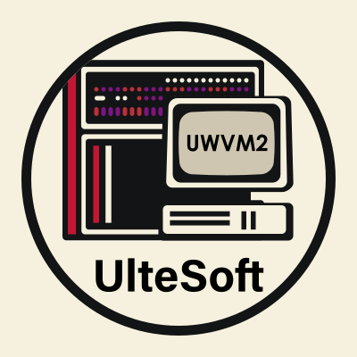

<div align="center">
  
  <br/>
  <h1>Ultimate WebAssembly Virtual Machine 2</h1>
</div>

> [!IMPORTANT]
> This project is currently only developer stable
>

<div style="text-align:center">
    <a href="https://github.com/UlteSoft/uwvm2/actions?query=workflow%3ACI">
        
    </a>
    <a href="LICENSE.md">
        
    </a>
    <a href="https://en.cppreference.com">
        
    </a>
</div>

## Introduction
Ultimate WebAssembly Virtual Machine (Version 2), the abbreviation is uwvm2.

## Features
### WASM Feature Extensions
Most wasm standards are supported. See [feature.md](documents/features.md)

### Supports multiple platforms
Supports over 100 triplet platforms, including DOS series, POSIX series, Windows 9x series, Windows NT series, and the Host C Library Series. Supports interpretation execution (INT), just-in-time compilation (JIT), and tiered compilation (TC). See [support.md](documents/support.md) for details.

## Commandline interface
* Get version information
```bash
$ uwvm --version
```
* Get a list of commands
```bash
$ uwvm --help
```
* Running uwvm2 virtual machine
```bash
$ uwvm <param0> <param1> ... --run <wasm> <argv1> <argv2> ...
```
* WASI mount root
```bash
$ uwvm --wasi-mount-root $WASM_ROOT_PATH ... --run ...
```

## How to build
* Windows (aka. unknown-windows-msvc). See [windows.md](documents/how-to-build/windows.md)
* MinGW (aka. unknown-windows-gnu, unknown-w64-mingw32). See [mingw.md](documents/how-to-build/mingw.md)
* Linux (aka. unknown-linux-unknown). See [linux.md](documents/how-to-build/linux.md)
* Darwin (aka. unknown-apple-darwin). See [darwin.md](documents/how-to-build/darwin.md)
* FreeBSD (aka. unknown-freebsd(Version)). See [freebsd.md](documents/how-to-build/freebsd.md)
* WASM-WASI (self-hosting) (aka. [wasm32|wasm64]-[wasip1|wasip2]-(threads)). See [wasm-wasi.md](documents/how-to-build/wasm-wasi.md)
