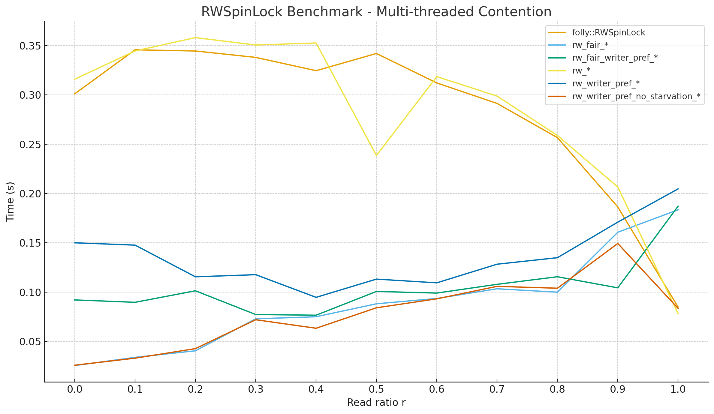
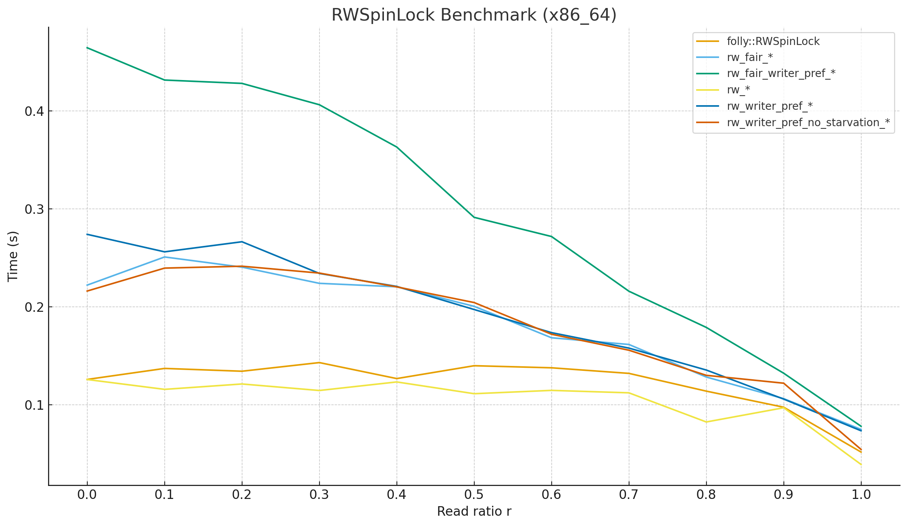

# RWSpinLock Benchmark (uwvm2::utils::mutex::rwlock_t)

- Platform: `aarch64-apple-darwin` (Apple M4)
- Benchmark binary: `benchmark/0001.utils/0001.mutex/RWSpinLock`
- Implementations compared:
  - A minimal port of `folly::RWSpinLock` (`bench_folly::RWSpinLock` in this file).
  - Project `rwlock_t` variants:
    - `rw_shared_guard_t` / `rw_unique_guard_t` (reader-preferred, non-fair).
    - `rw_writer_pref_shared_guard_t` / `rw_writer_pref_unique_guard_t` (writer-preferred, non-fair).
    - `rw_writer_pref_no_starvation_*` (writer-preferred, writer-starvation-free).
    - `rw_fair_*` (phase-fair, writer-starvation-free).
    - `rw_fair_writer_pref_*` (phase-fair + writer-biased).

## Build and Run

```bash
cd benchmark/0001.utils/0001.mutex
CXXFLAGS_EXTRA="--sysroot=$SYSROOT -fuse-ld=lld" lua compare_rwspinlock.lua
```

The Lua driver will:

- Compile `RWSpinLock.cc` into `outputs/RWSpinLock`.
- Run the benchmark and capture detailed output in `outputs/rwspinlock_bench.log`.
- Write a condensed summary to `outputs/rwspinlock_summary.txt`.

All numbers in the next section are from one full run on the Apple M4 platform (unit: seconds).

## Code Provenance

- The baseline `bench_folly::RWSpinLock` implementation is adapted from
  `folly::RWSpinLock` as of commit `7243f43c1b4cd974b332ac81727db0c860f271a7`:
  <https://github.com/facebook/folly/blob/7243f43c1b4cd974b332ac81727db0c860f271a7/folly/synchronization/RWSpinLock.h#L122>
- The `uwvm2::utils::mutex::rwlock_t` implementation and this benchmark configuration
  correspond to project commit `3c6ccdb2fb3e9ec06cfe25991341a0a01e99ab18`:
  <https://github.com/MacroModel/uwvm2/commit/3c6ccdb2fb3e9ec06cfe25991341a0a01e99ab18>

## Multi-threaded Contention: Read/Write Ratio Sweep

- Threads: `8`
- Iterations per thread: `200000`
- `r` denotes the fraction of read operations in the workload:
  - `r = 0.0` → 100% writes
  - `r = 1.0` → 100% reads

### folly::RWSpinLock (baseline)

| read ratio `r` | time (s) |
|----------------|----------|
| 0.0 | 0.301108167 |
| 0.1 | 0.345754000 |
| 0.2 | 0.344545333 |
| 0.3 | 0.338046166 |
| 0.4 | 0.324551042 |
| 0.5 | 0.342033292 |
| 0.6 | 0.312149292 |
| 0.7 | 0.291355333 |
| 0.8 | 0.256628250 |
| 0.9 | 0.186360041 |
| 1.0 | 0.084782041 |

### mylock: `rw_fair_*`

| read ratio `r` | time (s) |
|----------------|----------|
| 0.0 | 0.025470709 |
| 0.1 | 0.033782166 |
| 0.2 | 0.040445083 |
| 0.3 | 0.072867166 |
| 0.4 | 0.074983375 |
| 0.5 | 0.088119333 |
| 0.6 | 0.093504084 |
| 0.7 | 0.103350833 |
| 0.8 | 0.099896834 |
| 0.9 | 0.160689542 |
| 1.0 | 0.183468958 |

### mylock: `rw_fair_writer_pref_*` (fair + writer-biased)

| read ratio `r` | time (s) |
|----------------|----------|
| 0.0 | 0.092042000 |
| 0.1 | 0.089625625 |
| 0.2 | 0.101302084 |
| 0.3 | 0.077221792 |
| 0.4 | 0.076550792 |
| 0.5 | 0.100629250 |
| 0.6 | 0.098994833 |
| 0.7 | 0.107870458 |
| 0.8 | 0.115559375 |
| 0.9 | 0.104293250 |
| 1.0 | 0.187156667 |

### mylock: `rw_*` (reader-preferred, non-fair)

| read ratio `r` | time (s) |
|----------------|----------|
| 0.0 | 0.315937750 |
| 0.1 | 0.344576417 |
| 0.2 | 0.358129375 |
| 0.3 | 0.350595666 |
| 0.4 | 0.352678166 |
| 0.5 | 0.238508708 |
| 0.6 | 0.318561791 |
| 0.7 | 0.298790250 |
| 0.8 | 0.258836791 |
| 0.9 | 0.206629042 |
| 1.0 | 0.077965375 |

### mylock: `rw_writer_pref_*` (writer-preferred, non-fair)

| read ratio `r` | time (s) |
|----------------|----------|
| 0.0 | 0.149981000 |
| 0.1 | 0.147635833 |
| 0.2 | 0.115493250 |
| 0.3 | 0.117646833 |
| 0.4 | 0.094653916 |
| 0.5 | 0.113139167 |
| 0.6 | 0.109374917 |
| 0.7 | 0.128279750 |
| 0.8 | 0.134888625 |
| 0.9 | 0.170933042 |
| 1.0 | 0.204687834 |

### mylock: `rw_writer_pref_no_starvation_*` (writer-preferred, writer-starvation-free)

| read ratio `r` | time (s) |
|----------------|----------|
| 0.0 | 0.025823875 |
| 0.1 | 0.032951500 |
| 0.2 | 0.042639208 |
| 0.3 | 0.071940833 |
| 0.4 | 0.063302667 |
| 0.5 | 0.084057667 |
| 0.6 | 0.093150208 |
| 0.7 | 0.105799208 |
| 0.8 | 0.103917334 |
| 0.9 | 0.149297500 |
| 1.0 | 0.083441125 |

## Single-threaded Benchmarks

| case | time (s) |
|------|----------|
| folly single-thread read  | 0.010665959 |
| folly single-thread write | 0.002170041 |
| mylock single-thread read | 0.006281500 |
| mylock single-thread write| 0.008992917 |

## High-level Observations (Single Run, Apple M4)

- On this platform, the fair / starvation-free variants (`rw_fair_*` and `rw_writer_pref_no_starvation_*`) are consistently faster than the folly-style baseline under multi-threaded contention, especially in write-heavy workloads (`r` close to 0.0).
- The reader-preferred, non-fair variant (`rw_shared_guard_t` / `rw_unique_guard_t`) performs very well in read-heavy scenarios (`r` close to 1.0), but shows heavier contention and higher latency when writes are frequent or the workload is mixed.
- The non-fair writer-preferred variant (`rw_writer_pref_*`) offers a reasonable compromise in mixed workloads, but is not the fastest at the pure-read or pure-write extremes.
- The writer-preferred, starvation-free variant (`rw_writer_pref_no_starvation_*`) achieves performance broadly comparable to `rw_fair_*` while additionally ensuring that writers cannot be starved by an unbounded stream of new readers.

> Note: These numbers are from a single benchmark run on one machine. For rigorous conclusions, multiple runs and measurements on different platforms are recommended.



## Additional Results: x86_64 (Intel Core i7-13700F)

The following numbers were obtained by running the same benchmark binary on an x86_64 machine with an Intel Core i7-13700F CPU (unit: seconds).

### folly::RWSpinLock (baseline, x86_64)

| read ratio `r` | time (s) |
|----------------|----------|
| 0.0 | 0.125819935 |
| 0.1 | 0.137058010 |
| 0.2 | 0.134193917 |
| 0.3 | 0.143021313 |
| 0.4 | 0.126689332 |
| 0.5 | 0.139813138 |
| 0.6 | 0.137698962 |
| 0.7 | 0.132002213 |
| 0.8 | 0.113865601 |
| 0.9 | 0.097431267 |
| 1.0 | 0.051634758 |

### mylock: `rw_fair_*` (x86_64)

| read ratio `r` | time (s) |
|----------------|----------|
| 0.0 | 0.222157018 |
| 0.1 | 0.250912337 |
| 0.2 | 0.240525707 |
| 0.3 | 0.223964641 |
| 0.4 | 0.220448537 |
| 0.5 | 0.200496823 |
| 0.6 | 0.168370400 |
| 0.7 | 0.161525087 |
| 0.8 | 0.128287358 |
| 0.9 | 0.106167590 |
| 1.0 | 0.074786694 |

### mylock: `rw_fair_writer_pref_*` (x86_64)

| read ratio `r` | time (s) |
|----------------|----------|
| 0.0 | 0.464588902 |
| 0.1 | 0.431620210 |
| 0.2 | 0.428203730 |
| 0.3 | 0.406400210 |
| 0.4 | 0.363210868 |
| 0.5 | 0.291397370 |
| 0.6 | 0.271801837 |
| 0.7 | 0.215928349 |
| 0.8 | 0.178950446 |
| 0.9 | 0.132165346 |
| 1.0 | 0.077989257 |

### mylock: `rw_shared_guard_t` / `rw_unique_guard_t` (x86_64)

| read ratio `r` | time (s) |
|----------------|----------|
| 0.0 | 0.125732152 |
| 0.1 | 0.115671535 |
| 0.2 | 0.121170085 |
| 0.3 | 0.114512183 |
| 0.4 | 0.123247374 |
| 0.5 | 0.111239976 |
| 0.6 | 0.114633512 |
| 0.7 | 0.112135078 |
| 0.8 | 0.082360819 |
| 0.9 | 0.096878587 |
| 1.0 | 0.038977657 |

### mylock: `rw_writer_pref_*` (x86_64)

| read ratio `r` | time (s) |
|----------------|----------|
| 0.0 | 0.274025044 |
| 0.1 | 0.256148286 |
| 0.2 | 0.266446047 |
| 0.3 | 0.234094531 |
| 0.4 | 0.220809950 |
| 0.5 | 0.197230241 |
| 0.6 | 0.173605151 |
| 0.7 | 0.157830127 |
| 0.8 | 0.135410184 |
| 0.9 | 0.105746664 |
| 1.0 | 0.073378736 |

### mylock: `rw_writer_pref_no_starvation_*` (x86_64)

| read ratio `r` | time (s) |
|----------------|----------|
| 0.0 | 0.216104250 |
| 0.1 | 0.239526767 |
| 0.2 | 0.241461241 |
| 0.3 | 0.234457859 |
| 0.4 | 0.220356094 |
| 0.5 | 0.204344044 |
| 0.6 | 0.171972358 |
| 0.7 | 0.155676716 |
| 0.8 | 0.130009907 |
| 0.9 | 0.121969581 |
| 1.0 | 0.054328192 |

### Single-threaded Benchmarks (x86_64)

| case | time (s) |
|------|----------|
| folly single-thread read  | 0.009145662 |
| folly single-thread write | 0.009131499 |
| mylock single-thread read | 0.009992890 |
| mylock single-thread write| 0.025608184 |

