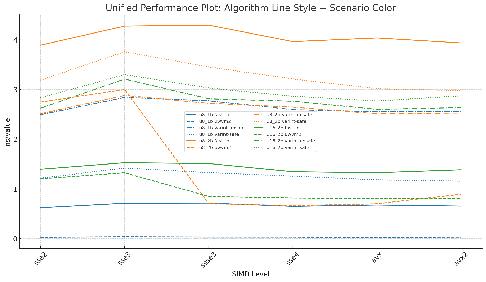

# FunctionSection LEB128<u32> benchmark vs Rust `varint-simd`

This directory contains a micro-benchmark for uwvm2’s wasm `function_section` LEB128<u32> decoder and a Lua driver that compares it against the Rust crate [`as-com/varint-simd`](https://github.com/as-com/varint-simd).

- C++ benchmark: `FunctionSectionVarintSimd.cc`
- Lua driver: `compare_varint_simd.lua`
- Rust fair benchmark: `varint-simd-fair/` (uses the `varint-simd` crate)

The benchmark:

- generates a large contiguous buffer of LEB128<u32>-encoded function type indices **once per scenario** on the C++ side;
- writes the generated data to shared binary files under `outputs/data`:
  - `${FS_BENCH_DATA_DIR}/${scenario}.bin` with:
    - 8-byte little-endian `u64`: number of encoded values (`FUNC_COUNT`)
    - raw LEB128 bytes for those values
- decodes the entire buffer many times (scalar baseline and SIMD path) in the uwvm2 C++ benchmark, reading from the shared files into heap-allocated buffers (no mmap);
- runs the Rust fair benchmark in `varint-simd-fair/`, which depends on the cloned `varint-simd` crate and decodes the **same** shared LEB128 streams (also reading from file into `Vec<u8>` / `Vec<u16>`, no mmap);
- reports average time per decoded value (ns/value) and throughput (GiB/s) for both uwvm2 and varint-simd on identical inputs.

Unless otherwise noted, the example numbers in this file come from a single run on an Intel Core i9‑14900HK laptop (AVX2), with:

- C++ built using `clang++ -std=c++2c -O3 -ffast-math -march=native -fno-rtti -fno-unwind-tables -fno-asynchronous-unwind-tables`
- Rust fair benchmark run with `RUSTFLAGS="-C target-cpu=native"` and `cargo run --release` in `varint-simd-fair/`
- uwvm2 repository at commit [`03bc4a36cf8037386a91bf8fdf73a652d6230a8d`](https://github.com/MacroModel/uwvm2/commit/03bc4a36cf8037386a91bf8fdf73a652d6230a8d)
- `as-com/varint-simd` crate at commit [`41a86e3470b7cc8b5cc17f9d20f86679b325715d`](https://github.com/as-com/varint-simd/commit/41a86e3470b7cc8b5cc17f9d20f86679b325715d)

## Prerequisites and basic build steps

Before running the benchmark, make sure the following tools are available on your `$PATH`:

- `clang++` (or a compatible C++ compiler) with C++26 support
- `rustc` and `cargo` (for building the Rust `varint-simd` helper)
- `lua` (5.3 or later)
- `git` (for cloning `as-com/varint-simd` when needed)

A quick sanity check:

```bash
clang++ --version
rustc --version
cargo --version
lua -v
git --version
```

If any of these commands fail, install the corresponding toolchain first. On platforms that require a custom sysroot or linker (for example, cross-compilation setups), you can pass extra C++ flags through `CXXFLAGS_EXTRA`, e.g.:

```bash
CXXFLAGS_EXTRA="--sysroot=$SYSROOT -fuse-ld=lld" lua benchmark/0002.parser/0001.function_section/compare_varint_simd.lua
```

On non‑x86 platforms that do not expose the x86 SIMD intrinsics used by `varint-simd`, the Rust part of the benchmark may fail to build. In that case the Lua driver will still run the uwvm2 C++ benchmarks and emit a clear warning that no `varint-simd` baseline is available on this host.

## Methodology

### uwvm2 side (data generation and decode)

The C++ benchmark in `FunctionSectionVarintSimd.cc`:

- generates one large LEB128<u32> stream per scenario using a fixed RNG seed;
- if `FS_BENCH_DATA_DIR` is set, writes the stream to `${FS_BENCH_DATA_DIR}/${scenario}.bin` with:
  - an 8-byte little-endian `u64` header containing `FUNC_COUNT`;
  - the raw LEB128 bytes for all encoded values;
- if the file already exists, reuses it and verifies that its header matches the requested `FUNC_COUNT`;
- reads the shared LEB128 stream from disk into a `std::vector<std::byte>` (heap allocation, no memory mapping);
- decodes it `ITERS` times using:
  - a scalar baseline (`fast_io::mnp::leb128_get`), and
  - the SIMD function-section decoder (`scan_function_section_impl_*`);
- prints machine-readable lines of the form:

```text
uwvm2_fs scenario=<...> impl=<scalar|simd> values=<...> total_ns=<...> \
         ns_per_value=<...> avg_bytes_value=<...> gib_per_s=<...>
```

The scenarios are:

- `u8_1b`  
  typeidx `< 2^7`, always 1-byte LEB128 encodings; mapped to `scan_function_section_impl_u8_1b`.
- `u8_2b`  
  `2^7 ≤ typeidx < 2^8`, 1–2 byte encodings; mapped to `scan_function_section_impl_u8_2b`.
- `u16_2b`  
  `2^8 ≤ typeidx < 2^14`, 1–2 byte encodings decoded into a `u16` array; mapped to `scan_function_section_impl_u16_2b`.

Each scenario reports both the scalar baseline and the SIMD path.

### varint-simd side (fair decode on shared files)

The Lua script:

- clones (or reuses) the upstream `as-com/varint-simd` repository into `outputs/varint-simd`;
- runs the Rust fair benchmark located in `varint-simd-fair/` via:
  - `FS_BENCH_DATA_DIR=<...>/outputs/data`
  - `RUSTFLAGS="-C target-cpu=native"`
  - `cargo run --release`
- the Rust fair benchmark:
  - reads `${FS_BENCH_DATA_DIR}/${scenario}.bin` into a `Vec<u8>` (for `u8_1b` / `u8_2b`) or `Vec<u16>` (for `u16_2b`), adding a small padding area required by `decode_unsafe`;
  - decodes the LEB128 stream `ITERS` times using both `varint_simd::decode_unsafe` (unsafe) and `varint_simd::decode` (safe) with the same `FUNC_COUNT` and `ITERS` as the C++ benchmark;
  - prints machine-readable lines of the form:

```text
varint_simd_fs scenario=<...> impl=unsafe values=<...> total_ns=<...> \
               ns_per_value=<...> avg_bytes_value=<...> gib_per_s=<...>
varint_simd_fs scenario=<...> impl=safe   values=<...> total_ns=<...> \
               ns_per_value=<...> avg_bytes_value=<...> gib_per_s=<...>
```

The Lua driver currently uses the `impl=unsafe` lines for its ratios, but the `impl=safe` lines are also emitted so that users can inspect the performance of the safe `decode` API on the same shared LEB128 streams.

## Running the fair shared-data benchmark

From the project root on a Unix-like system, you can run the fair benchmark (shared files, no original Criterion `varint_bench` run) with:

```bash
lua benchmark/0002.parser/0001.function_section/compare_varint_simd.lua
```

This command will:

- build and run the C++ benchmark, generating or reusing `${repo_root}/benchmark/0002.parser/0001.function_section/outputs/data/*.bin` and decoding them from heap-allocated buffers (no mmap);
- clone `as-com/varint-simd` into `benchmark/0002.parser/0001.function_section/outputs/varint-simd` if it is not already present;
- build and run the Rust `varint-simd-fair` helper, which decodes the same `.bin` files from heap-allocated `Vec` buffers;
- print per-scenario ns/value for uwvm2 and varint-simd on identical input streams.

If you want to override the defaults (e.g., change the number of values or iterations), you can set:

```bash
export FUNC_COUNT=20000000   # number of values per scenario
export ITERS=20              # number of outer iterations
lua benchmark/0002.parser/0001.function_section/compare_varint_simd.lua
```

The Lua driver forwards these variables to both the C++ and Rust fair benchmarks so that all measurements remain comparable.

### Selecting a fixed SIMD level (SSE2 / AVX / AVX2 / AVX-512, etc.)

By default, both the C++ and Rust code are built for the native host CPU (e.g., AVX2 on an i9‑14900HK) using `-march=native` / `-C target-cpu=native`. To force a fair configuration where uwvm2 and varint-simd are compiled for the same *fixed* SIMD level (without any CPUID-based runtime downgrades), you can set:

```bash
export UWVM2_SIMD_LEVEL=<level>
lua benchmark/0002.parser/0001.function_section/compare_varint_simd.lua
```

The recognized `<level>` values are:

- `native`      : default, `-march=native` / `-C target-cpu=native`
- `sse2`        : x86‑64 + SSE2
- `sse3`        : x86‑64 + SSE3
- `ssse3`       : x86‑64 + SSSE3
- `sse4`        : x86‑64 + SSE4.1/SSE4.2
- `avx`         : x86‑64 + AVX
- `avx2`        : x86‑64 + AVX2
- `avx512bw`    : x86‑64 + AVX2 + AVX‑512BW
- `avx512vbmi`  : x86‑64 + AVX2 + AVX‑512BW + AVX‑512VBMI/VBMI2

In these modes:

- the C++ benchmark adds the corresponding `-m...` flags (e.g., `-msse2`, `-mavx2`, `-mavx512bw -mavx512vbmi -mavx512vbmi2`) instead of `-march=native`, so the compiler only emits instructions up to the requested SIMD level for uwvm2’s scalar/SIMD paths;
- the Rust fair benchmark extends `RUSTFLAGS` with an explicit `-C target-cpu=x86-64 -C target-feature=...` string that enables exactly the same SIMD features (e.g., `+sse2,+sse3,+ssse3,+sse4.1,+sse4.2,+avx,+avx2` for `avx2`), so the `varint-simd` crate is compiled under the same ISA.

This ensures that, for a chosen SIMD level (SSE2, SSE3, SSSE3, SSE4, AVX, AVX2, AVX‑512BW, AVX‑512VBMI), both uwvm2 and varint-simd are evaluated using the same statically selected instruction set, without relying on runtime CPUID dispatch.

## Example results (i9‑14900HK, AVX2)

All times are in ns/value (smaller is faster).

| Scenario | Description                                        | uwvm2 scalar | uwvm2 SIMD | varint-simd (unsafe) | varint-simd (safe) |
|----------|----------------------------------------------------|--------------|------------|-----------------------|---------------------|
| u8_1b    | 1-byte encodings, zero-copy view fast path         | 0.3788       | 0.0165     | ≈ 2.5590              | ≈ 1.2078           |
| u8_2b    | 1–2 byte encodings into `u8` array (main compare)  | 2.5696       | 0.9691     | ≈ 2.6691              | ≈ 3.1461           |
| u16_2b   | 1–2 byte encodings into `u16` array (stress case)  | 1.0386       | 0.8275     | ≈ 2.4951              | ≈ 2.7019           |

- The uwvm2 numbers come from the `ns_per_value` field of the C++ benchmark.
- The varint-simd (unsafe) numbers come from the `varint_simd_fs` lines with `impl=unsafe` printed by the Rust fair benchmark, which decodes the same shared LEB128 streams using `varint_simd::decode_unsafe`.
- The varint-simd (safe) numbers come from the corresponding `varint_simd_fs` lines with `impl=safe` (using `varint_simd::decode`).

### Relative ratios (dimensionless)

Ratios are `uwvm2 / varint-simd`; values `< 1` mean uwvm2 is faster.

| Scenario | scalar / unsafe | SIMD / unsafe | scalar / safe | SIMD / safe |
|----------|-----------------|---------------|---------------|-------------|
| u8_1b    | ≈ 0.148         | ≈ 0.006       | ≈ 0.314       | ≈ 0.014     |
| u8_2b    | ≈ 0.963         | ≈ 0.363       | ≈ 0.817       | ≈ 0.308     |
| u16_2b   | ≈ 0.416         | ≈ 0.332       | ≈ 0.384       | ≈ 0.306     |

## How to interpret each scenario

### `u8_1b` – upper-bound fast path (not a 1:1 fair comparison)

The `u8_1b` scenario uses the specialized fast path `scan_function_section_impl_u8_1b`, which:

- assumes all type indices are `< 2^7` (single-byte LEB128 encodings);
- validates the LEB128 stream and creates a zero-copy `u8` view over the function types;
- does **not** materialize every value into a separate array element.

In contrast, the varint-simd fair benchmark decodes each LEB128 value into a `u8` array using `decode_unsafe::<u8>`. The very large reported speedup (ratio ≈ 0.006) is therefore an upper bound for a highly specialized validation/view fast path, not an apples-to-apples comparison against a generic varint decoder that always decodes into an array.

### `u8_2b` – main fair decoder comparison

The `u8_2b` scenario is the primary, reasonably fair comparison point:

- both uwvm2 and the varint-simd fair benchmark decode 1–2 byte LEB128<u32> values into an array of `u8`;
- both sides run on the **exact same** LEB128 byte stream, generated once by the C++ code and written to `${FS_BENCH_DATA_DIR}/u8_2b.bin`;
- the benchmark reports ns/value for both implementations.

The encoded distribution corresponds to uniformly sampling type indices in `[0, type_section_count)` with `type_section_count = 200`, which yields an average encoded length of about 1.36 bytes per value (see the `avg_bytes_value` field). The fair benchmark ensures this distribution is identical for uwvm2 and varint-simd.

Under this setup, the measured ratio of ≈ 0.363 (≈ 2.8× faster) reflects a genuine SIMD decoding advantage for uwvm2’s function-section decoder on this class of data.

### `u16_2b` – stress / completeness scenario (not a fully symmetric compare)

The `u16_2b` scenario decodes LEB128<u32> type indices into a `u16` array, using values in the range:

- `2^8 ≤ typeidx < 2^14`

This intentionally exercises 14‑bit indices that always fit into 1–2 LEB128 bytes. The top 2 bits of the 16‑bit domain are never used, so **3‑byte `u16` encodings do not occur** in this scenario.

By contrast, varint-simd’s `varint-u16/decode` benchmarks the full `u16` range `[0, 65535]`, which includes many values that require 3‑byte LEB128 encodings. A perfectly symmetric comparison against `varint-u16/decode` would therefore require a hypothetical `u16_3b` path in uwvm2 that also covers 3‑byte encodings.

uwvm2 intentionally does not implement such a `u16_3b` decoder. In realistic WebAssembly modules:

- the number of distinct function types is typically small (for example, around 100 type signatures for 10,000 functions);
- type indices that require 3‑byte LEB128 encodings are therefore not expected to appear in practice.

The `u16_2b` scenario should thus be interpreted as:

- a realistic upper-end stress/completeness case for the function-section decoder, aligned with the expected density of wasm function types;
- **not** a fully fair 1:1 comparison against varint-simd’s full `u16` domain, which spends more work on rare 3‑byte encodings that uwvm2 never sees by design.

## Summary of fairness

- `u8_2b` is the main “fair” decoder comparison: both sides decode 1–2 byte LEB128<u32> values into a `u8` array, with only a minor difference in value distributions.
- `u8_1b` is a specialized fast path (SIMD + zero-copy view) and should be viewed as an upper bound for a highly optimized validation path, not as a general varint-decoder comparison.
- `u16_2b` is a practical stress/completeness scenario that intentionally ignores 3‑byte `u16` encodings; a fully symmetric comparison to `varint-u16/decode` would require a `u16_3b` path, which uwvm2 does not implement because real wasm function sections do not need that many distinct type indices.
## Summary of fairness

## Performance Comparison of SIMD Implementations

This section compiles the per-value execution times (ns/value) output by the Lua script `compare_varint_simd.lua` when explicitly setting C++ and Rust compilation parameters for different `UWVM2_SIMD_LEVEL` (SSE2, SSE3, SSSE3, SSE4, AVX, AVX2) on a fixed host.

All time units are ns/value, where lower values indicate faster performance. Both the uwvm2 scalar baseline and SIMD implementation are shown; the ratio column represents `uwvm2 SIMD / varint-simd (unsafe)`, with values below 1 indicating uwvm2 SIMD is faster.

| UWVM2_SIMD_LEVEL | Scenario | fast_io (uwvm2 scalar) ns/value | uwvm2 ns/value | varint-simd (unsafe) ns/value | ratio (SIMD/unsafe) | varint-simd (safe) ns/value |
|------------------|----------|------------------------|---------------------|--------------------------------|----------------------|-----------------------------|
| sse2             | u8_1b    | 0.623009               | 0.028107            | ≈ 2.493716                     | ≈ 0.011              | ≈ 1.216680                  |
| sse2             | u8_2b    | 3.892114               | 2.747664            | ≈ 2.515034                     | ≈ 1.092              | ≈ 3.188452                  |
| sse2             | u16_2b   | 1.396773               | 1.204023            | ≈ 2.623844                     | ≈ 0.459              | ≈ 2.831848                  |
| sse3             | u8_1b    | 0.713941               | 0.037465            | ≈ 2.840755                     | ≈ 0.013              | ≈ 1.420337                  |
| sse3             | u8_2b    | 4.276907               | 3.000886            | ≈ 2.879563                     | ≈ 1.042              | ≈ 3.760658                  |
| sse3             | u16_2b   | 1.528552               | 1.325757            | ≈ 3.211448                     | ≈ 0.413              | ≈ 3.299425                  |
| ssse3            | u8_1b    | 0.716849               | 0.032394            | ≈ 2.773981                     | ≈ 0.012              | ≈ 1.328446                  |
| ssse3            | u8_2b    | 4.296264               | 0.705934            | ≈ 2.722914                     | ≈ 0.259              | ≈ 3.453877                  |
| ssse3            | u16_2b   | 1.512101               | 0.850092            | ≈ 2.812776                     | ≈ 0.302              | ≈ 3.031550                  |
| sse4             | u8_1b    | 0.651683               | 0.031192            | ≈ 2.595154                     | ≈ 0.012              | ≈ 1.258592                  |
| sse4             | u8_2b    | 3.963856               | 0.666224            | ≈ 2.646469                     | ≈ 0.252              | ≈ 3.212863                  |
| sse4             | u16_2b   | 1.346232               | 0.817972            | ≈ 2.765576                     | ≈ 0.296              | ≈ 2.863301                  |
| avx              | u8_1b    | 0.678372               | 0.018877            | ≈ 2.555923                     | ≈ 0.007              | ≈ 1.182833                  |
| avx              | u8_2b    | 4.037088               | 0.702502            | ≈ 2.512577                     | ≈ 0.280              | ≈ 3.014511                  |
| avx              | u16_2b   | 1.326338               | 0.802967            | ≈ 2.601113                     | ≈ 0.309              | ≈ 2.769782                  |
| avx2             | u8_1b    | 0.657058               | 0.015158            | ≈ 2.558267                     | ≈ 0.006              | ≈ 1.157513                  |
| avx2             | u8_2b    | 3.937200               | 0.895701            | ≈ 2.527859                     | ≈ 0.354              | ≈ 2.982243                  |
| avx2             | u16_2b   | 1.384856               | 0.807479            | ≈ 2.636942                     | ≈ 0.306              | ≈ 2.871885                  |

The above data is derived from a single baseline run and is primarily intended for comparing the relative performance of uwvm2 and varint-simd (both scalar and SIMD paths) across different SIMD levels, rather than serving as absolute performance metrics across machines.


